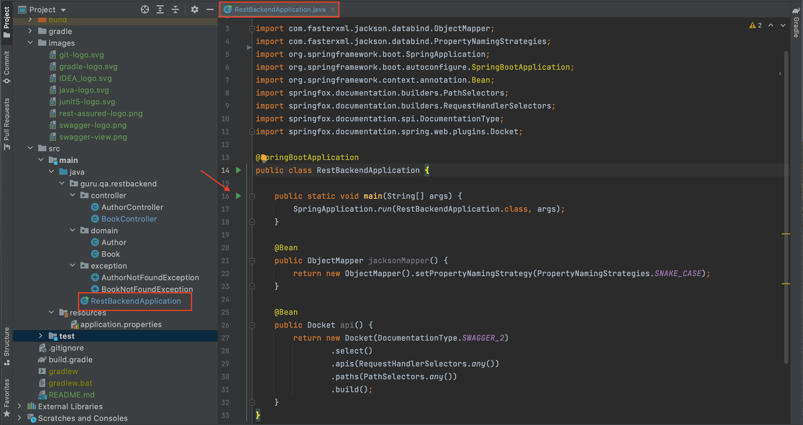
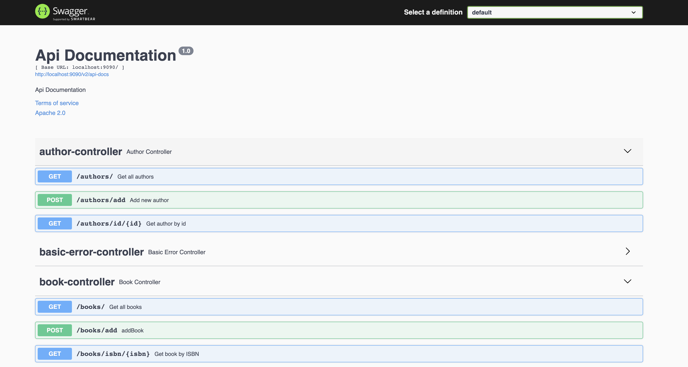
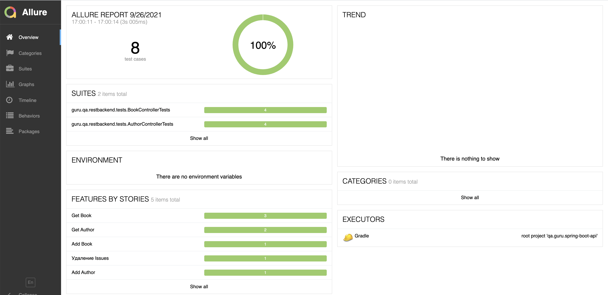
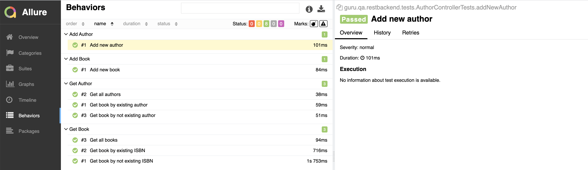

<div align="center">

# Spring Demo Library — REST API & API Test Suite

A small, production-shaped **Spring Boot** service for a books-and-authors "library", paired with a
**black-box REST-assured** test suite and **Allure** reporting. Built to demonstrate clean API design,
structured observability, and a credible automated-testing workflow on a modern JVM stack.


</div>

---

## Table of Contents

- [Overview](#overview)
- [Tech Stack](#tech-stack)
- [Architecture](#architecture)
- [Quick Start](#quick-start)
- [API Reference](#api-reference)
- [Interactive API Docs (Swagger / OpenAPI)](#interactive-api-docs-swagger--openapi)
- [Testing](#testing)
- [Observability — Structured Logging](#observability--structured-logging)
- [Project Layout](#project-layout)
- [Conventions & Design Notes](#conventions--design-notes)

---

## Overview

The service exposes a tiny domain — **books** and **authors** — over a JSON HTTP API. Data is held
in memory (no database), which keeps the focus on the parts that matter for a demo of this kind:

- **API design & contract** — predictable resources, `snake_case` JSON, correct status codes.
- **Self-documentation** — OpenAPI 3.1 served live via springdoc, browsable in Swagger UI.
- **Automated testing** — a behaviour-first REST-assured suite that exercises the running service
  exactly as a client would.
- **Observability** — JSON logs with per-request correlation IDs, ready for log aggregation.



## Tech Stack

| Concern | Choice |
|---|---|
| Language / Runtime | **Java 25** (Gradle toolchain) |
| Framework | **Spring Boot 4.1.0** (Spring Framework 7, Jakarta EE) |
| Build | **Gradle 9.5.1** (wrapper) |
| API docs | **springdoc-openapi 3.0.3** → OpenAPI 3.1 + Swagger UI |
| JSON | **Jackson 3** (`tools.jackson`), `snake_case` |
| Boilerplate | **Lombok** (via `io.freefair.lombok`) |
| Logging | **Logback + logstash-logback-encoder 9.0** (structured JSON) |
| API tests | **REST-assured 6**, **JUnit 5**, **AssertJ** |
| Reporting | **Allure 2.35** |

## Architecture

A thin, layer-light web service — controllers serve an in-memory dataset, with a servlet filter for
cross-cutting request correlation.

```
HTTP ──▶ RequestIdFilter ──▶ @RestController ──▶ in-memory data
        (X-Request-Id → MDC)   (LibraryController,
                                AuthorsController)
```

- **`controller/`** — `LibraryController` (`/books/**`), `AuthorsController` (`/authors/**`). Paths
  are declared per-method; springdoc derives the OpenAPI spec from the handlers.
- **`domain/`** — `BooksInfo`, `Authors`, `BooksData`: Lombok `@Builder`/`@Data` POJOs with
  `@JsonNaming(SnakeCaseStrategy)`.
- **`exception/`** — `InvalidAuthorException` (→ `404`), `NullAuthorException`, mapped to HTTP status.
- **`web/RequestIdFilter`** — a `OncePerRequestFilter` that puts a validated correlation id into the MDC.

## Quick Start

**Prerequisite:** JDK 25 on `PATH` (or pointed to via `JAVA_HOME`). Everything else comes through the
Gradle wrapper — no local Gradle install needed.

```bash
# Run the API (http://localhost:8080)
./gradlew bootRun
```

```bash
# Sanity check
curl -s http://localhost:8080/books/getAll | jq
```

## API Reference

All bodies are JSON in `snake_case`.

| Method | Path | Description | Body | Success |
|---|---|---|---|---|
| `GET`  | `/books/getAll` | List all books | — | `200` |
| `POST` | `/books/getBookInfoListByAuthor` | Books by author | `{ "author_name": "Mark Tven" }` | `200` / `404` if none |
| `POST` | `/books/putBook` | Add a book | `BooksInfo` | `200` |
| `GET`  | `/authors/getAllAuthors` | List all authors | — | `200` |
| `POST` | `/authors/getAuthor` | Find an author by name | `{ "author_name": "Nikolai Gogol" }` | `200` / `404` if not found |
| `PUT`  | `/authors/putAuthor` | Add an author | `{ "author_name": "Joshua Bloch" }` | `200` |

> **Correlation:** every response carries an `X-Request-Id` header. Send your own (a safe token,
> ≤ 64 chars of `[A-Za-z0-9_-]`) to thread it through the logs, or let the service mint a UUID.

## Interactive API Docs (Swagger / OpenAPI)

With the app running:

- **Swagger UI** → http://localhost:8080/swagger-ui.html
- **OpenAPI 3.1 JSON** → http://localhost:8080/v3/api-docs



## Testing

The suite is **black-box**: REST-assured drives real HTTP against a running instance on
`localhost:8080` — there is no embedded test context. **Start the app first**, then run the tests.

```bash
# Terminal 1 — start the service
./gradlew bootRun

# Terminal 2 — run the suite (16 tests)
./gradlew clean test
```

Run in parallel by passing a thread count:

```bash
./gradlew clean test -Dthreads=4
```

**Coverage** — happy-path and error-path for every endpoint: list/add/lookup books and authors,
plus 404s for unknown authors. All **16 tests pass** against the current build.

### Allure report

```bash
./gradlew allureServe
```

<div align="center">




</div>

## Observability — Structured Logging

Logs are **JSON by default** (`logstash-logback-encoder`), one event per line, ready to ship to a log
backend. A `requestId` field — sourced from the inbound `X-Request-Id` or a generated UUID — is
promoted onto every event so a single request can be traced end to end.

```json
{"@timestamp":"2026-06-12T03:33:05.46+04:00","level":"WARN","logger_name":"…controller.LibraryController",
 "message":"No books found for author","requestId":"trace-abc-123","author":"Nobody","step":"author_lookup"}
```

Prefer human-readable logs while developing locally:

```bash
./gradlew bootRun --args='--spring.profiles.active=human-logs'
```

## Project Layout

```
src/
├── main/
│   ├── java/ru/nelakov/springdemolibrarywithapitests/
│   │   ├── controller/   # LibraryController, AuthorsController
│   │   ├── domain/       # BooksInfo, Authors, BooksData (Lombok)
│   │   ├── exception/    # mapped to HTTP status
│   │   └── web/          # RequestIdFilter (MDC correlation)
│   └── resources/
│       ├── application.properties   # Jackson snake_case
│       └── logback-spring.xml       # JSON / human-logs profiles
└── test/
    ├── java/specs/                  # shared REST-assured RequestSpecifications
    ├── java/listeners/              # Allure attachment templates
    └── java/ru/nelakov/springdemoTest/  # JUnit 5 + AssertJ tests
```

## Conventions & Design Notes

- **`snake_case` everywhere.** Boot 4 **and** REST-assured 6 both run on **Jackson 3**. The DTO
  `@JsonNaming` annotations target `tools.jackson`, and `spring.jackson.property-naming-strategy=SNAKE_CASE`
  is set globally — keeping client and server in lockstep. (A stray Jackson-2 `@JsonNaming` is silently
  ignored under Jackson 3 — the classic cause of `null` fields after a major upgrade.)
- **Dates** serialize as ISO-8601 strings (Boot's default), e.g. `"publish_date":"1970-01-01T00:20:34.567Z"`.
- **Tests favour behaviour over implementation** — they assert observable HTTP responses, not internals.
  As an integration suite they require a live server; unit/slice coverage of the controllers would be the
  natural next layer (see Fowler's test pyramid).
